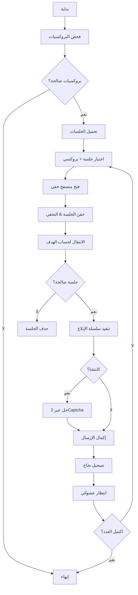

🐦 Black Raven OS – Advanced Security Auditing Framework

الإصدار: 2.0.1
المطور: Abu Jamal Abdul Nasser Al-Shawki
الباحث: خبير أمن سيبراني | مطور أدوات اختبار الاختراق
تواصل: @Abu_jamal777 على تليجرام

---

📌 نظرة عامة

Black Raven OS هو إطار عمل متطور لاختبار مرونة أنظمة مكافحة الأتمتة في منصات التواصل الاجتماعي الكبرى، مع تركيز خاص على منصة X (تويتر).
يُستخدم النظام لأغراض البحث الأمني الأخلاقي واختبار الاختراق في بيئات معزولة، بهدف تحليل آليات الدفاع وتطوير تقنيات مضادة.

---

🚀 القدرات الرئيسية

الميزة الوصف
إدارة الجلسات حقن ملفات تعريف الارتباط (Cookies) لتجاوز تسجيل الدخول المتكرر.
محرك التخفي playwright-stealth لتزييف بصمات المتصفح (WebGL، Canvas، User-Agent).
حل الكابتشا تكامل كامل مع 2Captcha لحل تحديات Arkose Labs تلقائياً.
إدارة البروكسي الذكية فحص حيوي للبروكسيات واستخدام النشط منها فقط.
التحكم في التزامن asyncio.Semaphore لإدارة عدد المتصفحات المتوازية وتجنب الحظر.
توليد نصوص ديناميكية بلاغات فريدة مع معرفات مرجعية لتجنب التكرار.

---

⚙️ المتطلبات الأساسية

· نظام التشغيل: Ubuntu 20.04+ (أو أي توزيعة Linux تدعم Python 3.8+)
· البرمجيات: Python 3.8–3.11، pip، Git
· الخدمات الخارجية:
  · مفتاح API من 2Captcha
  · بروكسيات سكنية (Residential Proxies) – يُفضل BrightData أو Oxylabs
  · حسابات اختبارية على X (يفضل أن تكون قديمة)

---

📦 التثبيت

```bash
# 1. إنشاء المجلدات
mkdir ~/black_raven_os && cd ~/black_raven_os
mkdir sessions logs

# 2. تثبيت المكتبات
pip install -r requirements.txt
playwright install chromium

# 3. إعداد config.json (انظر المثال أدناه)
```

مثال requirements.txt

```
playwright==1.42.0
playwright-stealth==1.0.1
2captcha-python==1.2.4
fake-useragent==1.5.1
aiohttp==3.9.3
colorama==0.4.6
```

مثال config.json

```json
{
  "target_username": "your_test_account",
  "reporting_intensity": 10,
  "concurrency_limit": 3,
  "captcha_key": "YOUR_2CAPTCHA_KEY",
  "proxies": ["user:pass@ip:port"],
  "report_type": "harassment",
  "enable_logging": true,
  "log_file": "logs/activity.log"
}
```

---

🧩 إعداد الجلسات

استخدم account_manager.py لتوليد جلسات مسجلة:

```bash
python account_manager.py
```

· سيفتح المتصفح (headless=False) لتسجيل الدخول يدوياً.
· بعد النجاح، يتم حفظ الجلسة في sessions/username.json.
· كرر لكل حساب ترغب في إضافته.

---

⚡ تشغيل الهجوم

```bash
python main_robot.py
```

ماذا يحدث؟

1. فحص البروكسيات النشطة.
2. تحميل الجلسات المتاحة.
3. تنفيذ البلاغات بعدد وكثافة محددين.
4. تسجيل كل عملية في logs/activity.log.

---

🧠 الهندسة الداخلية



المكونات الرئيسية:

· ProxyManager: يختبر البروكسيات ويقدم الأنشط فقط.
· BlackRavenOS: المحرك الرئيسي، ينسق العمليات ويدير التزامن.
· AccountManager: أداة مساعدة لتوليد الجلسات.
· Stealth Engine: يعتمد على playwright-stealth لتزييف البصمة.

---

🔧 استراتيجيات لرفع معدل النجاح

· بروكسيات سكنية: تجنب بروكسيات مراكز البيانات (تكتشفها X بسهولة).
· حسابات معتقة: استخدم حسابات أقدم من 6 أشهر.
· توقعات عشوائية: أضف asyncio.sleep(random(10, 30)) بين العمليات.
· مراقبة السجلات: تابع logs/activity.log وتحليل الأخطاء.

---

🛠️ استكشاف الأخطاء

المشكلة الحل
No healthy proxies تحقق من صيغة البروكسي، اختبرها يدوياً.
Session expired احذف ملف الجلسة وأعد إنشاؤه عبر account_manager.py.
Selector not found حدث المحددات (data-testid) يدوياً باستخدام أدوات المطور.
فشل حل الكابتشا تأكد من رصيد 2Captcha ومن صحة sitekey.

---

⚖️ الاعتبارات القانونية والأخلاقية

تحذير: هذا المشروع للأغراض التعليمية والبحثية فقط.

· يُستخدم فقط في بيئات معزولة أو بحسابات تملكها.
· أي استخدام للإضرار بالآخرين يعتبر غير قانوني ويتحمل المستخدم المسؤولية الكاملة.
· المطور (Abu Jamal Al-Shawki) يخلي مسؤوليته عن أي سوء استخدام.

---

📞 التواصل

· تليجرام: @Abu_jamal777
· البريد الإلكتروني: (للتواصل الجاد فقط)

---

تم التطوير بواسطة:
Abu Jamal Abdul Nasser Al-Shawki
خبير أمن سيبراني | مطور أدوات اختبار الاختراق
"المعرفة قوة، والحكمة في استخدامها."
